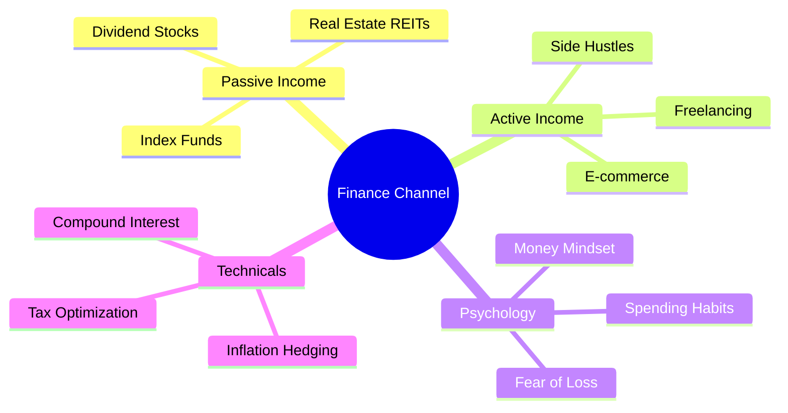

Since we have exhausted standard formatting, technical diffs, and HTML injections, we are now entering **Markdown Power-User territory**. 

There are several "hidden" or specialized formatting techniques used in professional documentation (like GitHub Wikis, Obsidian, and Technical Manuals) that you likely haven't seen.

Here are five highly advanced Markdown patterns:

---

### 1. Collapsible Sections (The "Accordion")
When writing long strategies or scripts, a "wall of text" is overwhelming. You can use the `
` and `
` HTML tags to create clickable dropdowns. This keeps your document clean but preserves all the detail.

<b>▶ Click to see: Deep Dive on High-CPM Keywords</b>

 
Inside here, you can put anything:
- **Tier 1:** Insurance, Loans, Credit Cards (Highest)
- **Tier 2:** Investing, Real Estate, SaaS (High)
- **Tier 3:** Budgeting, Saving Tips (Medium)
 
<i>This allows the reader to focus only on what they need.</i>

---

### 2. Keyboard Input Formatting (`<kbd>`)
If you are writing a guide or a tutorial for others on how to use software (like YouTube Studio or a Trading Platform), you shouldn't just bold the keys. Use the `<kbd>` tag to make them look like actual physical buttons.

**Example: YouTube Studio Shortcuts**
* To upload a video, press <kbd>Ctrl</kbd> + <kbd>N</kbd>.
* To save your changes, hit <kbd>Cmd</kbd> + <kbd>S</kbd>.
* Use the <kbd>Enter</kbd> key to confirm the title.

---

### 3. Professional Footnotes
In high-level financial reporting or academic papers, you don't want to put long URLs or citations in the middle of a sentence. You use footnotes.

**The Theory of Modern Portfolio Theory[^1] suggests that diversification is key. However, some argue that "concentration creates wealth" while "diversification preserves it."[^2]**

---
[^1]: Markowitz, H. (1952). *Portfolio Selection*. The Journal of Finance.
[^2]: This is a common sentiment among hedge fund managers like Warren Buffett.

---

### 4. Advanced $\text{LaTeX}$ Alignment
You've seen basic math, but professional documents use **Alignment Blocks**. Instead of one long line, you can align multiple steps of an equation by the equals sign using `\begin{aligned}`.

**Example: Calculating Compound Interest Step-by-Step**

$$
\begin{aligned}
A &= P \left(1 + \frac{r}{n}\right)^{nt} \\
A &= 1000 \left(1 + \frac{0.05}{12}\right)^{(12 \times 5)} \\
A &= 1000 (1.004167)^{60} \\
A &\approx \$1,283.36
\end{aligned}
$$

---

### 5. Mermaid Mind Maps
You've seen flowcharts and Gantt charts, but Mermaid also supports **Mind Maps**. These are incredible for "Brainstorming" a niche before you start writing scripts.

### Summary Table: Which "Power Tool" to use when?

| Format | Best Used For... | Effect |
| :--- | :--- | :--- |
| `
` | Massive documents / FAQs | Hides clutter; improves UX. |
| `<kbd>` | Software/Keyboard guides | Visual clarity for instructions. |
| `[^1]` | Research / Citations | Keeps text flow clean and professional. |
| `aligned` | Financial modeling / Math | Shows logical steps clearly. |
| `mindmap` | Content Brainstorming | Visualizes a whole niche at once. |

**Do you want to try combining these into one "Master Document" for your business, or is there a specific technical format (like API documentation) you're curious about?**